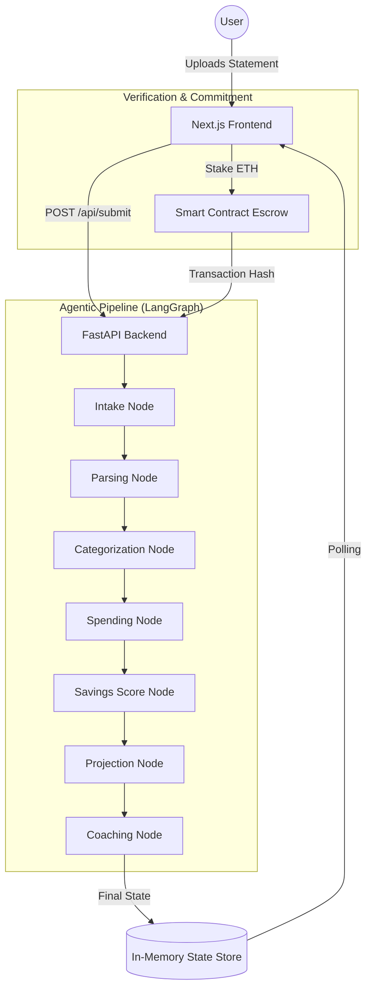

# ExpenseAutopsy: Technical Architecture & Logic Engine

This document provides a deep-dive into the mathematical models, agentic workflows, and validation logic that power the ExpenseAutopsy platform.

---

## 1. System Architecture Overview

ExpenseAutopsy uses a **Decentralized Agentic Architecture**. The system is split into a high-performance FastAPI backend (Logic Engine) and a Next.js frontend (Interaction Layer), orchestrated via a LangGraph state machine.



---

## 2. Mathematical Models & Logic

### A. The "Money Mirror" Projection (Future Value)
To calculate the 5-year opportunity cost, we use the **Future Value of an Ordinary Annuity** formula. This calculates what your "monthly waste" would grow to if invested in a standard index fund (8% p.a.).

**Formula:**
$$FV = P \times \frac{(1 + r)^n - 1}{r}$$

**Where:**
*   $P$ = Monthly Waste (AI-identified discretionary spend)
*   $r$ = Monthly interest rate ($\frac{0.08}{12} = 0.00667$)
*   $n$ = Number of periods ($5 \text{ years} \times 12 \text{ months} = 60$)

---

### B. Savings Opportunity Score (SOS)
The SOS is a weighted algorithm that determines how much "leakage" exists in a user's behavior. It is calculated out of 100 based on four deterministic rules:

| Rule | Metric | Weight |
| :--- | :--- | :--- |
| **Discretionary Ratio** | If `Discretionary Spend / Total Spend > 50%` | +30 pts |
| **Concentration** | If `Highest Category / Total Spend > 40%` | +30 pts |
| **Magnitude** | If `Highest Category Monthly Spend > ₹5,000` | +20 pts |
| **Recurring Habit** | If "Subscriptions" are detected in breakdown | +20 pts |

**SOS Algorithm:**
$$\text{Score} = \min(100, \sum \text{Weights of Matched Rules})$$

---

## 3. The Agentic Validation Loop (Supervisor Logic)

Unlike simple scripts, our system uses a **Stateful Graph**. Each node is an "Agent" that can validate or reject the work of the previous node.

| Node | Responsibility | Logic Pattern |
| :--- | :--- | :--- |
| **Intake** | Guardrail | Validates input length and basic financial keywords. |
| **Parsing** | Extraction | Multi-format support (Regex for text, JSON parsing for structured data). |
| **Categorization**| Classification | Uses a Bayesian-style mapping to group merchants (Uber $\to$ Travel, Swiggy $\to$ Food). |
| **Supervisor (God Mode)** | Verification | Calculates a **Confidence Score** based on data completeness ($C = \frac{\text{Parsed Count}}{\text{Input Count}}$). |

---

## 4. Data Schemas (The Contract)

### A. Graph State (The "Brain")
This schema tracks the evolution of data through the pipeline:
```python
class ExpenseGraphState(TypedDict):
    raw_input: str               # Raw text or JSON string
    parsed_transactions: List    # Cleaned list of {merchant, amount, date}
    categorized_transactions: List
    spending_breakdown: Dict     # { "Food": 5000, "Travel": 2000 }
    savings_score: int           # SOS (0-100)
    monthly_waste: int           # P value for math
    raw_5_year_loss: int         # P * 60
    future_invested_value: int   # FV result
    emotional_message: str       # Generated AI coaching
```

### B. User Profile
```python
{
    "id": "UUID",
    "stipend": "Monthly Budget",
    "selected_goal": "Financial Target (e.g., Bike)",
    "wallet_address": "Web3 Stake Identity"
}
```

---

## 5. Flow of Truth (Proof of Work)

1.  **Data Ingestion**: Raw data is converted into a structured `TransactionSet`.
2.  **Deterministic Processing**: Math nodes (`Projection`, `SavingsScore`) execute hardcoded Python functions—**they do not guess.**
3.  **AI Orchestration**: The `CoachingNode` takes the *output* of the math nodes and uses it as context to generate the "Blunt Truth" message.
4.  **Verification**: The "God Mode" dashboard exposes the `agent_analysis` trace, proving that a multi-step audit occurred before the results were "Anchored."

---

> [!IMPORTANT]
> **Integrity Statement:** All financial projections in ExpenseAutopsy are derived from standard financial mathematics (Time Value of Money). The AI's role is **Pattern Recognition** (Behavioral Analysis), while the Backend's role is **Mathematical Validation**.
